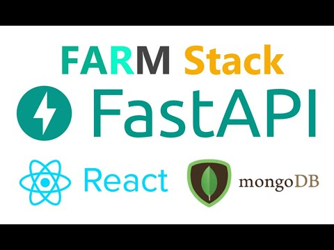

# PreUni-Verse

PreUni-Verse is an online learning management system that allows students to easily book tutorial classes and view information about upcoming classes. The platform is designed to help students maximize their learning potential by providing a user-friendly interface that is easy to navigate and use.

## Features

- Easy class booking: Students can easily browse through available classes and book a class that fits their schedule and learning goals.

- Upcoming classes: Students can view information about upcoming classes such as the date, time, location, and teacher.

- Personalized dashboard: Students can access their personalized dashboard that displays their current and upcoming classes, as well as their learning progress.

- Seamless communication: Students can communicate with their teachers and fellow students directly through the platform.

## Technology Stack

PreUni-Verse is built using the following technologies:

- Frontend: React Native
- Backend: RESTful Flask Python
- Database: MongoDB

### React Native

React Native was chosen for the frontend of PreUni-Verse due to its advantages in cross-platform development, fast rendering, and reusable components. With React Native, we were able to create a seamless user experience on both iOS and Android devices, while also ensuring that the app runs smoothly and efficiently.

### Flask Python

Flask Python was used for the backend of PreUni-Verse due to its lightweight and flexible framework, making it ideal for building RESTful APIs. With Flask, we were able to create a scalable and reliable backend that can handle a large number of concurrent requests, ensuring that the platform is always available to students.

### MongoDB

MongoDB was chosen as the database for PreUni-Verse due to its flexibility, scalability, and ease of use. With MongoDB, we were able to create a NoSQL database that can handle large volumes of data, while also providing fast and efficient data retrieval. Additionally, MongoDB's document-based structure allows us to store complex data structures, making it ideal for storing information about classes, students, and teachers.

## Value Proposition

The value proposition of PreUni-Verse is convenience and ease of use for parents and students who want to book tutorial sessions. Previously, parents had to call in to book a session, which could be time-consuming and inconvenient. With PreUni-Verse, parents can book tutorial sessions whenever and wherever they want, using their mobile devices. This allows them to easily find a session that fits their schedule, and they can do it all without having to pick up the phone.

## First Mover Advantage

Being the first to move to market for a mobile app for a tutoring company would be impactful because it would give the company a competitive advantage. By being the first to offer a mobile app, the company can differentiate itself from its competitors and position itself as a leader in the tutoring industry. Additionally, a mobile app can help increase brand awareness and customer loyalty, as it provides a convenient and accessible way for parents and students to book sessions and engage with the company. This can lead to increased revenue and growth opportunities for the company in the long run.
